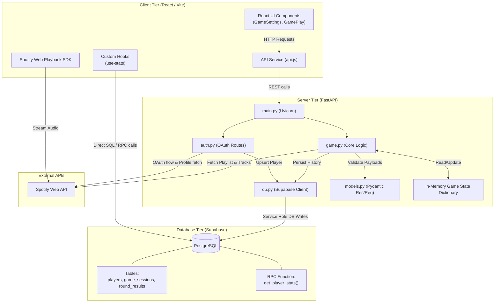
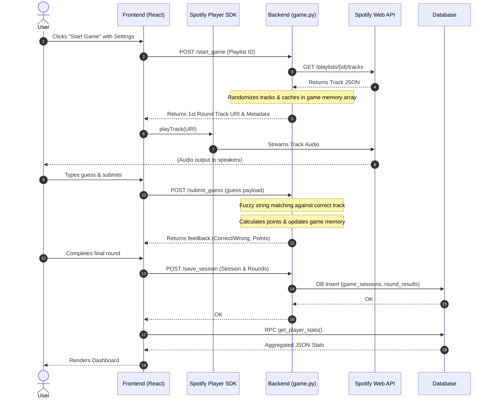
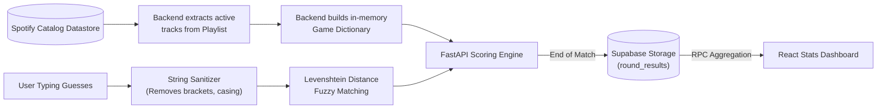

<div align="center">


# Beatify

**Guess the song from your own Spotify playlists.**

</div>

---

## 📸 Screenshots

<table>
  <tr>
    <td align="center"><br/><sub>Login · Dark</sub></td>
    <td align="center"><br/><sub>Login · Light</sub></td>
  </tr>
  <tr>
    <td align="center"><br/><sub>Game Settings · Dark</sub></td>
    <td align="center"><br/><sub>Game Settings · Light</sub></td>
  </tr>
  <tr>
    <td align="center"><br/><sub>Playlist Selection · Dark</sub></td>
    <td align="center"><br/><sub>Playlist Selection · Light</sub></td>
  </tr>
  <tr>
    <td align="center"><br/><sub>Gameplay · Dark</sub></td>
    <td align="center"><br/><sub>Gameplay · Light</sub></td>
  </tr>
  <tr>
    <td align="center"><br/><sub>Round Result · Dark</sub></td>
    <td align="center"><br/><sub>Round Result · Light</sub></td>
  </tr>
  <tr>
    <td align="center"><br/><sub>End Screen · Dark</sub></td>
    <td align="center"><br/><sub>End Screen · Light</sub></td>
  </tr>
</table>

---

## 🚀 Overview

Beatify is a music trivia game that turns any of your Spotify playlists into a live guessing challenge. Each round streams a short clip of a real song directly through the Spotify Web Playback SDK — no uploads, no pre-seeded data. You type what you hear: song name, artist, album, and release year.

The backend fetches tracks on demand from Spotify's API, scores your answers server-side using fuzzy string matching, and returns per-field breakdowns per round. A post-game analytics screen shows your accuracy rates, reflex times, and best streak across the session.

---

## 💡 Why Beatify?

Most music guessing games use static, curated datasets — the same songs recycled across every session. Beatify is different: it plugs directly into your Spotify library, so every game reflects your actual taste.

If you've built a gym playlist, a road trip mix, or a decade-specific deep-cut collection, Beatify can immediately turn it into a trivia challenge. The difficulty is inherently personal — you're being tested on music *you* chose, which makes near-misses more frustrating and perfect rounds genuinely impressive.

---

## 🎮 Features

### Core Gameplay

- **Live Spotify Playback** — streams actual songs via the Spotify Web Playback SDK; no pre-recorded clips
- **Configurable Snippet Duration** — four difficulty tiers control how long the clip plays before you must guess
- **Multi-field Guessing** — independently toggle Song Name (always on), Artist, Album, and Release Year per session
- **Fuzzy Answer Matching** — server-side scoring via `rapidfuzz`; minor typos and small variations are forgiven
- **Featured Artist Bonus** — each correctly guessed featured artist beyond the primary earns +1 extra point
- **Singles Rule** — when a track's album name equals its title (i.e. it's a single), typing `"single"`, `"none"`, `"no album"`, or the song name itself in the album field is accepted for full points

### Game Mechanics

- **Difficulty Levels**

  | Label | Snippet Duration |
  |-------|-----------------|
  | Listener | 10 seconds |
  | Performer | 5 seconds |
  | Producer | 3 seconds |
  | Virtuoso | 1 second |

- **Scoring**

  | Category | Points |
  |----------|--------|
  | Song Name | 5 |
  | Primary Artist | 2 |
  | Album | 3 |
  | Release Year | 2 |
  | Each Featured Artist | +1 |

- **Answer Timer** — optional countdown (10–60 s); auto-submits whatever is typed when it expires
- **Visual Hints** — three modes: Disabled (equalizer animation only), Progressive (album art reveals over 10 s), Manual Reveal (tap to unblur)
- **Streak Tracking** — live 🔥 counter increments on every perfect-score round; resets on any miss
- **Sanitization** — parenthesised text (e.g. `(Remix)`, `[Deluxe]`) stripped before comparison so partial matches don't penalise
- **Random Track Sampling** — backend samples random offsets across the full playlist without downloading all tracks; works on playlists of any size

### System Features

- **Dark / Light Mode** — Spotify-inspired colour palette; preference persisted in `localStorage` and applied before React hydrates (no flash)
- **Persistent Auth** — access and refresh tokens stored in `localStorage`; a global Axios interceptor silently refreshes the access token on 401s
- **Database Persistence** — game history securely logged to a Supabase PostgreSQL database via a backend `service_role` client, binding unique Spotify IDs to session histories flawlessly.
- **Server-Side Analytics Aggregation** — a native Postgres RPC function aggregates thousands of rows instantly within the database engine, returning a finalized, mathematically exact stats payload locally to eliminate O(N) client-side calculation loads.
- **Post-game Analytics** — average and fastest reflex time, per-category hit accuracy percentages, max streak, scrollable match history with album art and per-field result indicators
- **Tiered Audio Feedback** — six distinct sound effects mapped to score percentage tiers on each round result screen
- **Tiered Text Feedback** — randomised sarcastic / congratulatory message per score tier shown on the round result screen
- **Inline Rulebook** — floating help widget available on every screen with full rules, scoring table, and typo-tolerance explanation

---

## 🧠 Architecture & Data Flow

### System Overview



### Component Interaction (User Request Sequence)



### Data Processing Flow



Game state is securely maintained in-memory server-side, tied to individual authentications, while long-term persistent gameplay history logic is delegated strictly to the PostgreSQL analytics engine via Remote Procedure Calls.

---

## 🔧 Engineering Challenges

**Timer synchronisation with SDK latency**
The Spotify Web Playback SDK has a variable delay between the `playTrack` API call and the moment audio actually reaches the speaker. Starting the guess timer on the API call would consistently cheat players out of time. The fix: defer the timer start until `player_state_changed` fires with `!state.paused && state.position > 0`, guaranteeing the countdown only begins when sound is audible.

**Fuzzy matching across noisy real-world input**
Freeform text fields produce inconsistent guesses — extra words, punctuation, alternate spellings, parenthetical tags (`(Remix)`, `[Deluxe Edition]`). A two-pass strategy handles this: first strip brackets and collapse whitespace, then apply `token_set_ratio` for song/album fields and a combined global + per-chunk `ratio` check for multi-artist comma-separated input.

**Scalable random sampling on large playlists**
Fetching all tracks from a 600-track playlist to sample 10 is wasteful. Instead, the backend computes random absolute indices upfront, groups them by 50-track page offset, and issues only the minimal number of Spotify API calls needed — typically 1–3 requests regardless of playlist size.

**Transparent token refresh without user disruption**
SPAs lose state on refresh, and Spotify access tokens expire after an hour. A global Axios response interceptor catches 401s, silently exchanges the stored refresh token for a new access token, patches the original failed request, and retries — without the user seeing an error or being logged out.

**Flash of wrong theme on load**
Applying a CSS class via React state causes a brief flash of the default theme before hydration completes. The fix: an inline `<script>` in `index.html` reads `localStorage` and sets the correct class on `<html>` synchronously before any React code runs.

---

## ⚙️ Tech Stack

### Frontend
| Library | Purpose |
|---------|---------|
| React 18 + TypeScript | UI framework |
| Vite | Build tool and dev server |
| Tailwind CSS | Utility-first styling |
| shadcn/ui + Radix UI | Accessible component primitives |
| Axios | HTTP client with interceptor-based token refresh |
| Sonner | Toast notifications |
| lucide-react | Icon set |
| Spotify Web Playback SDK | In-browser audio streaming |

### Backend
| Library | Purpose |
|---------|---------|
| FastAPI | API framework |
| Uvicorn | ASGI server |
| Requests | Spotify Web API calls |
| rapidfuzz | Fuzzy string matching for answer scoring |
| python-dotenv | Environment variable loading |

### Database
| Technology | Purpose |
|---------|---------|
| Supabase | Cloud persistent data storage |
| PostgreSQL | Embedded relational DB backend |
| Row Level Security (RLS) | Secures individual dashboard `SELECT` queries seamlessly out-of-the-box |
| PL/pgSQL | Language orchestrating backend RPC statistical aggregation formulas |

### Integrations
- **Spotify Web API** — playlists, track metadata, OAuth 2.0 Authorization Code flow
- **Spotify Web Playback SDK** — in-browser Premium audio playback

---

## 📦 Installation

### Prerequisites
- Python 3.9+
- Node.js 18+
- A Spotify Developer app with a registered redirect URI

### 1. Spotify App Setup

1. Go to [Spotify Developer Dashboard](https://developer.spotify.com/dashboard)
2. Create an app and add `http://localhost:8000/callback` as a Redirect URI
3. Copy your **Client ID** and **Client Secret**

### 2. Backend

```bash
cd backend

# Create and activate virtual environment
python -m venv venv
venv\Scripts\activate        # Windows
# source venv/bin/activate   # macOS / Linux

# Install dependencies
pip install -r requirements.txt

# Create environment file
cp .env.example .env
# Fill in SPOTIFY_CLIENT_ID, SPOTIFY_CLIENT_SECRET, REDIRECT_URI, FRONTEND_URL

# Start the server
uvicorn main:app --reload
# Runs at http://localhost:8000
```

### 3. Frontend

```bash
cd frontend

npm install
npm run dev
# Runs at http://localhost:5173
```

---

## ▶️ Usage

1. **Login** — open `http://localhost:5173`, click **Connect with Spotify**, and authorise via the Spotify OAuth flow
2. **Configure** — choose difficulty, toggle timer and answer categories, set round count, and pick a playlist from your library
3. **Play** — a short snippet streams automatically; type song name, artist, album, and/or year before the timer expires, then press **Submit Guess**
4. **Review** — the round result screen reveals the correct answer, your points, and plays a sound effect scaled to your score
5. **End screen** — after the final round, view your total score, accuracy per category, reflex times, and scrollable match history; replay with the same settings or return to configure

---

## 🔐 Important Notes

- **Spotify Premium is required** for audio playback via the Web Playback SDK. Free accounts cannot stream tracks in-browser.
- **OAuth scopes requested**: `user-read-private`, `user-read-email`, `playlist-read-private`, `playlist-read-collaborative`, `streaming`, `user-read-playback-state`, `user-modify-playback-state`
- **Game state is in-memory** — restarting the backend server clears all active game sessions
- **Token key collision** — game state is keyed by the last 10 characters of the access token; in a multi-user deployment this is not safe. Suitable for local/personal use only in its current form
- The frontend dev server and backend must both be running simultaneously; the Spotify redirect URI must match exactly what is registered in your Developer Dashboard

---

## 📁 Project Structure

```
Beatify/
├── backend/
│   ├── main.py          # FastAPI app, CORS config, router registration
│   ├── auth.py          # /login, /callback, /refresh endpoints
│   ├── game.py          # /playlists, /start_game, /submit_guess, /next_round
│   ├── models.py        # Pydantic models (Track, GameState, GuessSubmission)
│   ├── requirements.txt
│   └── .env.example
│
├── frontend/
│   ├── public/
│   │   ├── favicon.svg       # Custom waveform logo
│   │   └── audio/            # SFX files (bell chime, violin win, game fail, …)
│   └── src/
│       ├── pages/
│       │   └── Index.tsx     # Root orchestrator — phase state machine, SDK init, playback
│       ├── components/game/
│       │   ├── LoginScreen.tsx
│       │   ├── GameSettings.tsx
│       │   ├── GamePlay.tsx
│       │   ├── RoundResult.tsx
│       │   ├── GameOver.tsx
│       │   ├── Rulebook.tsx
│       │   └── ThemeToggle.tsx
│       ├── hooks/
│       │   └── use-theme.ts  # Dark/light mode with localStorage persistence
│       └── api.js            # Axios instance, interceptor, all API calls
│
└── pics/                     # UI screenshots (dark + light variants)
```

---

## 📈 Future Improvements

- **Persistent storage** — replace in-memory game state with a database (e.g. PostgreSQL) and a caching layer (e.g. Redis) for session management and leaderboard support
- **Multiplayer** — shared game sessions with WebSocket synchronisation
- **Leaderboards** — cross-session score history per user
- **More hint types** — lyrics snippet, genre tag, decade hint

---

## 📄 License

MIT License. See [LICENSE](LICENSE) for details.

---

## 🙌 Credits

- [Spotify Web API](https://developer.spotify.com/documentation/web-api) — track data and OAuth
- [Spotify Web Playback SDK](https://developer.spotify.com/documentation/web-playback-sdk) — in-browser audio
- [rapidfuzz](https://github.com/maxbachmann/RapidFuzz) — fuzzy string matching
- [shadcn/ui](https://ui.shadcn.com) — component library
- [Lucide](https://lucide.dev) — icon set
