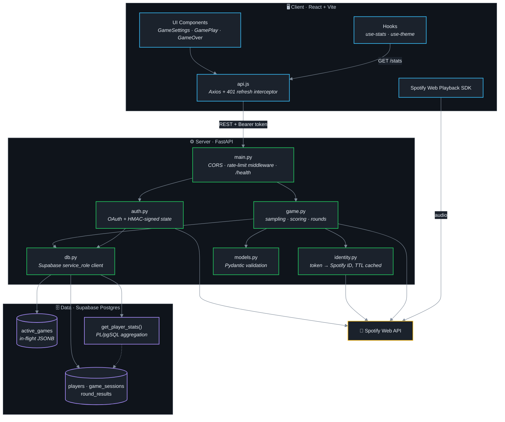
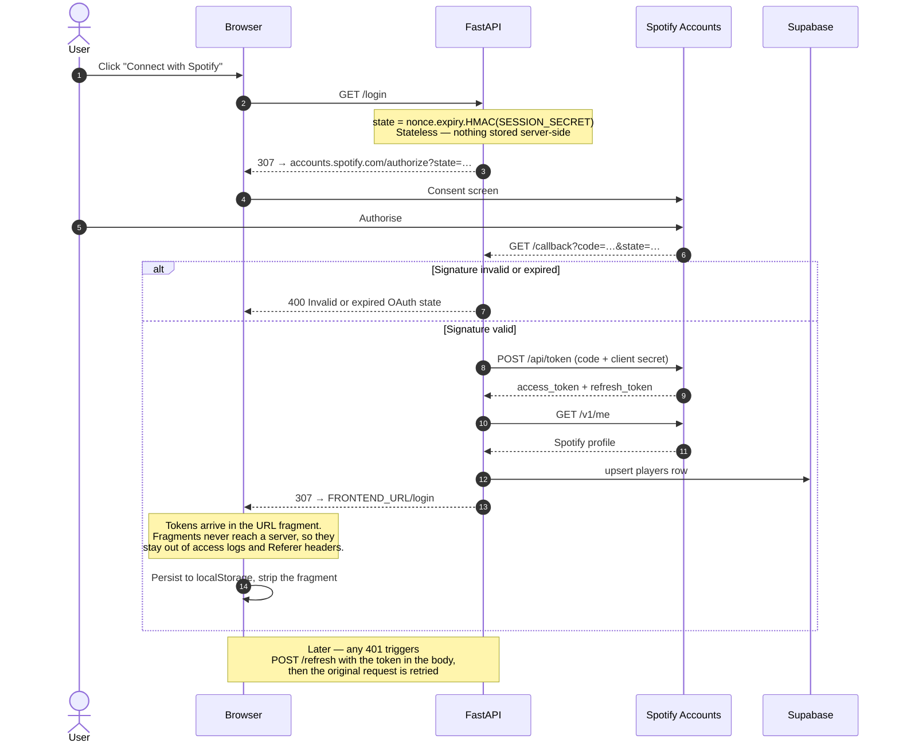
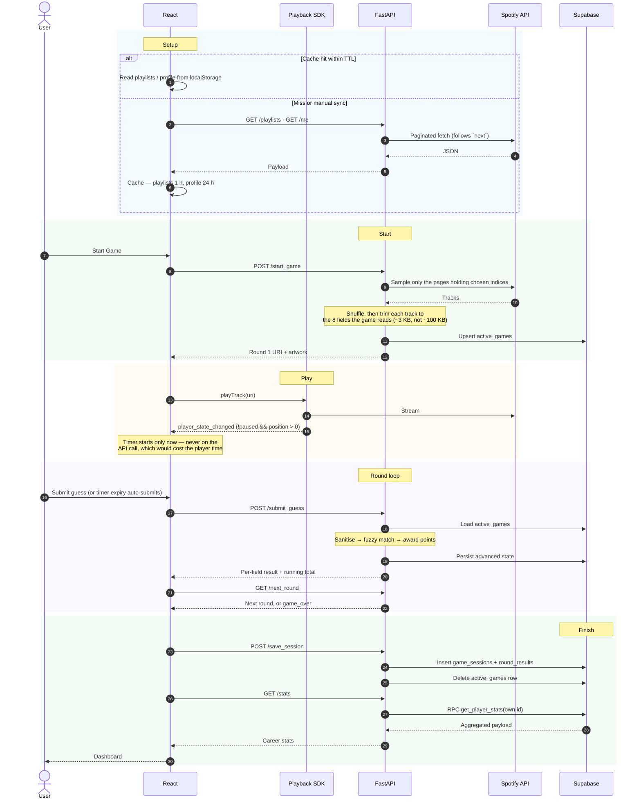
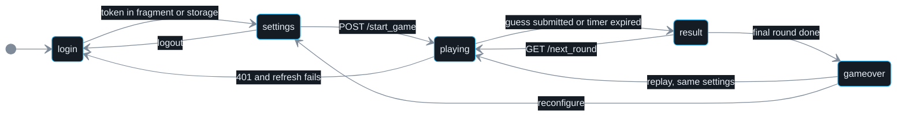
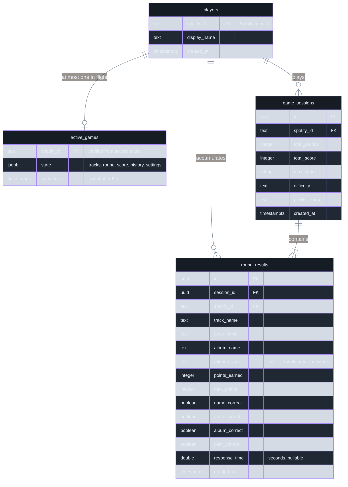
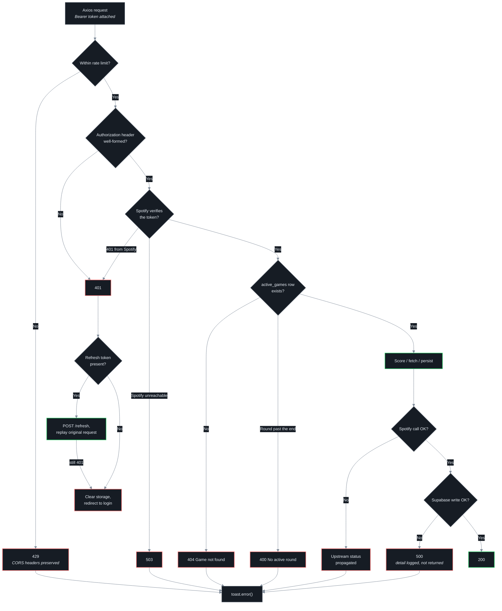

<div align="center">


# Beatify

**Guess the song from your own Spotify playlists.**

[](LICENSE)


</div>

---

## 📑 Contents

- [Overview](#-overview) · [Access & Status](#-access--status) · [Why Beatify](#-why-beatify)
- [Features](#-features) · [Game Mechanics](#-game-mechanics)
- [Architecture](#-architecture--data-flow) · [API Reference](#-api-reference) · [Security](#-security-model)
- [Engineering Challenges](#-engineering-challenges) · [Tech Stack](#-tech-stack)
- [Installation](#-installation) · [Environment Variables](#-environment-variables) · [Testing](#-testing)
- [Deployment](#-deployment) · [Troubleshooting](#-troubleshooting)
- [Project Structure](#-project-structure) · [Roadmap](#-roadmap) · [License](#-license)

---

## 📸 Screenshots

<table>
  <tr>
    <td align="center"><br/><sub>Login · Dark</sub></td>
    <td align="center"><br/><sub>Login · Light</sub></td>
  </tr>
  <tr>
    <td align="center"><br/><sub>Home Screen · Dark</sub></td>
    <td align="center"><br/><sub>Home Screen · Light</sub></td>
  </tr>
  <tr>
    <td align="center"><br/><sub>Playlist Selection · Dark</sub></td>
    <td align="center"><br/><sub>Playlist Selection · Light</sub></td>
  </tr>
  <tr>
    <td align="center"><br/><sub>Gameplay · Dark</sub></td>
    <td align="center"><br/><sub>Gameplay · Light</sub></td>
  </tr>
  <tr>
    <td align="center"><br/><sub>Round Result · Dark</sub></td>
    <td align="center"><br/><sub>Round Result · Light</sub></td>
  </tr>
  <tr>
    <td align="center"><br/><sub>End Screen · Dark</sub></td>
    <td align="center"><br/><sub>End Screen · Light</sub></td>
  </tr>
</table>

> The Home Screen and Login captures predate the current header lockup and are
> due for a retake.

---

## 🚀 Overview

Beatify is a music trivia game that turns any of your Spotify playlists into a live guessing challenge. Each round streams a short clip of a real song through the Spotify Web Playback SDK — no uploads, no pre-seeded data. You type what you hear: song name, artist, album, and release year.

The backend fetches tracks on demand from Spotify's API, scores answers server-side with fuzzy string matching, and returns a per-field breakdown each round. In-flight game state is persisted to Postgres so a refresh or a server restart never loses a game. A post-game screen shows accuracy rates, reflex times, and best streak, and every session is logged to Supabase to build an ongoing personal leaderboard.

---

## 🔑 Access & Status

**This app cannot be opened to the public, and the limit is Spotify's policy rather than anything in the code.** Stated plainly here because it determines what the project can be.

Spotify's [Developer Policy](https://developer.spotify.com/policy), Section III, prohibits the category outright:

> "Do not create a game, including trivia quizzes."

That applies whether or not an app streams Spotify audio — metadata-only use is covered too. Consequently, no quota extension is available for an app like this one.

Separately, [Extended Quota Mode](https://developer.spotify.com/documentation/web-api/concepts/quota-modes) — the only tier above the default — has required the following since May 2025:

| Requirement | Beatify |
|---|---|
| Legally registered business entity | ❌ Individual project |
| Active, launched service | ✅ |
| **Minimum 250,000 monthly active users** | ❌ Capped at 5 |
| Available in key Spotify markets | ✅ |
| Commercial viability | ❌ Non-commercial |

There is no intermediate tier. It is **5 users, then 250,000 MAU** — a deliberate catch-22, since a 5-user cap cannot grow into a 250k user base.

**What that means in practice:**

- **Development Mode allows 5 allowlisted users.** Each must be added by hand in the Spotify dashboard (Dashboard → your app → User Management). Anyone else receives a 403 on every request.
- **The app owner needs Spotify Premium** for a Development Mode app to function at all, per Spotify's February 2026 changes.
- **Every player needs Premium**, because the Web Playback SDK will not stream to free accounts.
- **Spotify-owned editorial playlists** (Discover Weekly, Today's Top Hits, …) return 404 in Development Mode. Only playlists created by users work.

Beatify is therefore a **private, self-hosted project for up to five people, and a portfolio piece.** Anyone forking it should plan around that rather than expect to publish it. A path that removes the ceiling is outlined in [Roadmap](#-roadmap).

---

## 💡 Why Beatify?

Most music guessing games use static, curated datasets — the same songs recycled across every session. Beatify plugs into your own library, so every game reflects your actual taste.

A gym playlist, a road trip mix, a decade-specific deep-cut collection: any of them becomes a trivia challenge. The difficulty is inherently personal — you are being tested on music *you* chose, which makes near-misses more frustrating and perfect rounds genuinely earned.

---

## 🎮 Features

### Core Gameplay

- **Live Spotify Playback** — streams real songs via the Web Playback SDK; no pre-recorded clips
- **Configurable Snippet Duration** — four difficulty tiers control how long the clip plays
- **Multi-field Guessing** — Song Name is always scored; Artist, Album, and Release Year toggle per session
- **Fuzzy Answer Matching** — server-side `rapidfuzz` scoring; typos and minor variations are forgiven
- **Replay Snippet** — optional inline repeat button for tough rounds, at no point cost
- **Featured Artist Bonus** — each correctly named featured artist beyond the primary earns +1
- **Singles Rule** — when a track's album name equals its title (i.e. a single), the album field also accepts `single`, `none`, `no album`, `n/a`, or `single release`
- **Resumable Games** — game state lives in Postgres, so a page refresh, a token refresh, or a backend restart mid-game all pick up exactly where you left off

### Analytics

- **Post-game Summary** — total score, average and fastest reflex time, per-category hit accuracy, max streak, and a scrollable match history with album art and per-field result indicators
- **Career Dashboard** — rounds played, total points, average response time, overall accuracy, and best streak, plus **Top Playlists**, **Top Artists**, and **Top Eras** ranked by rounds played and accuracy
- **Server-Side Aggregation** — a PL/pgSQL RPC aggregates history inside Postgres and returns a finished payload, so the client never loops over thousands of rows
- **Perfect Game Detection** — a full-streak session is called out explicitly on the end screen

### System

- **Dark / Light Mode** — Spotify-derived palette; preference persisted in `localStorage` and applied by an inline script before React mounts, so there is no theme flash
- **Transparent Token Refresh** — a global Axios interceptor catches 401s, exchanges the refresh token, patches the failed request, and retries without the user noticing
- **Response Caching** — `localStorage` wrapper with per-key TTLs: playlists 1 hour, profile 24 hours. Stats deliberately bypass the cache so the dashboard is never stale
- **Manual Sync & Logout** — explicit playlist re-sync, and a logout that clears cached profile and playlist data
- **Tiered Audio Feedback** — six sound effects mapped to score-percentage bands on the round result screen
- **Tiered Text Feedback** — a randomised message per score band, from consoling to congratulatory
- **Inline Rulebook** — floating help widget on the login and settings screens with full rules, the scoring table, and a typo-tolerance explanation
- **Rate Limiting** — per-client throttling on every route, tighter on the expensive ones
- **Reduced Motion** — all decorative animation is disabled under `prefers-reduced-motion`

---

## 🎯 Game Mechanics

### Difficulty

| Label | Snippet Heard | Playback Window |
|-------|---------------|-----------------|
| Listener | 10 s | 13 s |
| Performer | 5 s | 8 s |
| Producer | 3 s | 5 s |
| Virtuoso | 1 s | 3 s |

The playback window exceeds the snippet duration to absorb Web Playback SDK
start-up latency; the timer only counts audible time.

### Scoring

| Category | Points | Enabled |
|----------|--------|---------|
| Song Name | 5 | Always |
| Primary Artist | 2 | Optional |
| Album | 3 | Optional |
| Release Year | 2 | Optional |
| Each Featured Artist | +1 | With Artist |

Maximum per round is `5 + 2 + 3 + 2 = 12`, plus 1 per featured artist. Because
featured-artist bonuses can push a round above the nominal maximum, streak
detection compares with `>=` rather than `==`.

### Matching Rules

| Field | Algorithm | Threshold |
|-------|-----------|-----------|
| Song Name | `token_set_ratio` | 90 |
| Album | `token_set_ratio` | 90 |
| Artist (whole string) | `token_set_ratio` | 90 |
| Artist (per comma-separated chunk) | `ratio` | 80 |
| Release Year | exact match after sanitising | — |

Every comparison is preceded by the same sanitiser: bracketed text is stripped
(`(Remix)`, `[Deluxe Edition]`), remaining punctuation becomes whitespace,
runs of whitespace collapse, and the result is lowercased.

### Other Settings

| Setting | Range | Notes |
|---------|-------|-------|
| Rounds | 1–20 | Backend independently clamps to 1–50 |
| Answer Timer | 10–60 s, or off | Auto-submits whatever is typed on expiry |
| Visual Hints | Disabled · Progressive (10 s) · Manual Reveal | Progressive un-blurs album art over 10 s |
| Replay | On / off | No point penalty |

**Streak tracking** — a live 🔥 counter increments on every full-score round and resets on any miss.

**Random sampling** — the backend picks random absolute indices across the whole playlist, groups them into 50-track pages, and fetches only those pages. A 10-round game on a 600-track playlist typically costs 1–3 Spotify requests instead of 12.

---

## 🧠 Architecture & Data Flow

Colour in these diagrams encodes tier, not decoration: <b>blue</b> = browser,
<b>green</b> = backend, <b>purple</b> = database, <b>amber</b> = third party.

### System Overview


```mermaid
%%{init: {'theme':'base','themeVariables':{'fontFamily':'ui-sans-serif, system-ui, -apple-system, Segoe UI, sans-serif','fontSize':'13px','primaryColor':'#1b222c','primaryTextColor':'#e8eef5','primaryBorderColor':'#39424e','lineColor':'#7f8b99','clusterBkg':'#0f141b','clusterBorder':'#39424e','titleColor':'#c9d4e0','nodeTextColor':'#e8eef5','edgeLabelBackground':'#1b222c','tertiaryTextColor':'#c9d4e0'}}}%%
graph TD
    subgraph Client["🖥️ Client · React + Vite"]
        direction TB
        UI["UI Components<br/><i>GameSettings · GamePlay · GameOver</i>"]
        API_JS["api.js<br/><i>Axios + 401 refresh interceptor</i>"]
        HOOKS["Hooks<br/><i>use-stats · use-theme</i>"]
        PLAYER["Spotify Web Playback SDK"]
    end

    subgraph Server["⚙️ Server · FastAPI"]
        direction TB
        MAIN["main.py<br/><i>CORS · rate-limit middleware · /health</i>"]
        AUTH["auth.py<br/><i>OAuth + HMAC-signed state</i>"]
        GAME["game.py<br/><i>sampling · scoring · rounds</i>"]
        IDENT["identity.py<br/><i>token → Spotify ID, TTL cached</i>"]
        DBSVC["db.py<br/><i>Supabase service_role client</i>"]
        MODELS["models.py<br/><i>Pydantic validation</i>"]
    end

    subgraph Data["🗄️ Data · Supabase Postgres"]
        direction TB
        LIVE[("active_games<br/><i>in-flight JSONB</i>")]
        HIST[("players · game_sessions<br/>round_results")]
        RPC["get_player_stats()<br/><i>PL/pgSQL aggregation</i>"]
    end

    SPOT["🎵 Spotify Web API"]

    UI --> API_JS
    HOOKS -->|GET /stats| API_JS
    API_JS -->|REST + Bearer token| MAIN

    MAIN --> AUTH
    MAIN --> GAME
    GAME --> MODELS
    GAME --> IDENT
    AUTH --> SPOT
    IDENT --> SPOT
    GAME --> SPOT
    GAME --> DBSVC
    AUTH --> DBSVC

    DBSVC --> LIVE
    DBSVC --> HIST
    DBSVC --> RPC
    RPC -.-> HIST

    PLAYER -->|audio| SPOT

    classDef client fill:#1b222c,stroke:#38bdf8,stroke-width:1.5px,color:#e8eef5
    classDef server fill:#1b222c,stroke:#22c55e,stroke-width:1.5px,color:#e8eef5
    classDef data fill:#1b222c,stroke:#a78bfa,stroke-width:1.5px,color:#e8eef5
    classDef ext fill:#1b222c,stroke:#fbbf24,stroke-width:1.5px,color:#e8eef5

    class UI,API_JS,HOOKS,PLAYER client
    class MAIN,AUTH,GAME,IDENT,DBSVC,MODELS server
    class LIVE,HIST,RPC data
    class SPOT ext
```

### Authentication Flow

The `state` parameter is signed rather than stored, so no server-side session is
needed and a restart between `/login` and `/callback` cannot break a login.


```mermaid
%%{init: {'themeVariables':{'fontFamily':'ui-sans-serif, system-ui, Segoe UI, sans-serif','fontSize':'13px'}}}%%
sequenceDiagram
    autonumber
    actor U as User
    participant B as Browser
    participant API as FastAPI
    participant S as Spotify Accounts
    participant DB as Supabase

    U->>B: Click "Connect with Spotify"
    B->>API: GET /login
    Note over API: state = nonce.expiry.HMAC(SESSION_SECRET)<br/>Stateless — nothing stored server-side
    API-->>B: 307 → accounts.spotify.com/authorize?state=…
    B->>S: Consent screen
    U->>S: Authorise
    S-->>API: GET /callback?code=…&state=…

    alt Signature invalid or expired
        API-->>B: 400 Invalid or expired OAuth state
    else Signature valid
        API->>S: POST /api/token (code + client secret)
        S-->>API: access_token + refresh_token
        API->>S: GET /v1/me
        S-->>API: Spotify profile
        API->>DB: upsert players row
        API-->>B: 307 → FRONTEND_URL/login#access_token=…
        Note over B: Tokens arrive in the URL fragment.<br/>Fragments never reach a server, so they<br/>stay out of access logs and Referer headers.
        B->>B: Persist to localStorage, strip the fragment
    end

    Note over B,API: Later — any 401 triggers<br/>POST /refresh with the token in the body,<br/>then the original request is retried
```

### Gameplay Sequence


```mermaid
%%{init: {'themeVariables':{'fontFamily':'ui-sans-serif, system-ui, Segoe UI, sans-serif','fontSize':'13px'}}}%%
sequenceDiagram
    autonumber
    actor U as User
    participant R as React
    participant SDK as Playback SDK
    participant API as FastAPI
    participant S as Spotify API
    participant DB as Supabase

    rect rgba(56,189,248,0.06)
    Note over R: Setup
    alt Cache hit within TTL
        R->>R: Read playlists / profile from localStorage
    else Miss or manual sync
        R->>API: GET /playlists · GET /me
        API->>S: Paginated fetch (follows `next`)
        S-->>API: JSON
        API-->>R: Payload
        R->>R: Cache — playlists 1 h, profile 24 h
    end
    end

    rect rgba(34,197,94,0.06)
    Note over API: Start
    U->>R: Start Game
    R->>API: POST /start_game
    API->>S: Sample only the pages holding chosen indices
    S-->>API: Tracks
    Note over API: Shuffle, then trim each track to<br/>the 8 fields the game reads (~3 KB, not ~100 KB)
    API->>DB: Upsert active_games
    API-->>R: Round 1 URI + artwork
    end

    rect rgba(251,191,36,0.06)
    Note over SDK: Play
    R->>SDK: playTrack(uri)
    SDK->>S: Stream
    SDK-->>R: player_state_changed (!paused && position > 0)
    Note over R: Timer starts only now — never on the<br/>API call, which would cost the player time
    end

    rect rgba(167,139,250,0.06)
    Note over API: Round loop
    U->>R: Submit guess (or timer expiry auto-submits)
    R->>API: POST /submit_guess
    API->>DB: Load active_games
    Note over API: Sanitise → fuzzy match → award points
    API->>DB: Persist advanced state
    API-->>R: Per-field result + running total
    R->>API: GET /next_round
    API-->>R: Next round, or game_over
    end

    rect rgba(34,197,94,0.06)
    Note over DB: Finish
    R->>API: POST /save_session
    API->>DB: Insert game_sessions + round_results
    API->>DB: Delete active_games row
    R->>API: GET /stats
    API->>DB: RPC get_player_stats(own id)
    DB-->>API: Aggregated payload
    API-->>R: Career stats
    R-->>U: Dashboard
    end
```

### Client Phase Machine


```mermaid
%%{init: {'theme':'base','themeVariables':{'fontFamily':'ui-sans-serif, system-ui, Segoe UI, sans-serif','fontSize':'13px','primaryColor':'#161c24','primaryTextColor':'#e8eef5','primaryBorderColor':'#38bdf8','lineColor':'#7f8b99','edgeLabelBackground':'#161c24','tertiaryTextColor':'#c9d4e0'}}}%%
stateDiagram-v2
    direction LR
    [*] --> login

    login --> settings: token in fragment or storage
    settings --> playing: POST /start_game
    playing --> result: guess submitted or timer expired
    result --> playing: GET /next_round
    result --> gameover: final round done
    gameover --> playing: replay, same settings
    gameover --> settings: reconfigure
    playing --> login: 401 and refresh fails
    settings --> login: logout
```

### Data Processing


```mermaid
%%{init: {'theme':'base','themeVariables':{'fontFamily':'ui-sans-serif, system-ui, Segoe UI, sans-serif','fontSize':'13px','primaryColor':'#161c24','primaryTextColor':'#e8eef5','primaryBorderColor':'#39424e','lineColor':'#7f8b99','edgeLabelBackground':'#161c24','tertiaryTextColor':'#c9d4e0'}}}%%
flowchart LR
    Catalog[("Spotify Catalog")]
    Typed["Typed guess"]

    Sample["Random index sampling<br/><i>page-grouped fetch</i>"]
    Slim["Trim to 8 fields<br/><i>_slim_track</i>"]
    Persist[("active_games<br/><i>JSONB</i>")]
    San["Sanitise<br/><i>strip brackets, punctuation, case</i>"]
    Fuzz["Fuzzy match<br/><i>rapidfuzz token_set_ratio / ratio</i>"]
    Score["Scoring engine<br/><i>per-field points</i>"]
    Hist[("game_sessions<br/>round_results")]
    Agg["get_player_stats()<br/><i>in-database aggregation</i>"]
    Dash["Stats dashboard"]

    Catalog --> Sample --> Slim --> Persist --> Score
    Typed --> San --> Fuzz --> Score
    Score -->|each round| Persist
    Score -->|end of game| Hist
    Hist --> Agg --> Dash

    classDef src fill:#161c24,stroke:#fbbf24,stroke-width:1.5px,color:#e8eef5
    classDef proc fill:#161c24,stroke:#22c55e,stroke-width:1.5px,color:#e8eef5
    classDef store fill:#161c24,stroke:#a78bfa,stroke-width:1.5px,color:#e8eef5
    classDef out fill:#161c24,stroke:#38bdf8,stroke-width:1.5px,color:#e8eef5

    class Catalog,Typed src
    class Sample,Slim,San,Fuzz,Score,Agg proc
    class Persist,Hist store
    class Dash out
```

### Database Schema


```mermaid
%%{init: {'theme':'base','themeVariables':{'fontFamily':'ui-sans-serif, system-ui, Segoe UI, sans-serif','fontSize':'12px','primaryColor':'#161c24','primaryTextColor':'#e8eef5','primaryBorderColor':'#a78bfa','lineColor':'#7f8b99','attributeBackgroundColorOdd':'#161c24','attributeBackgroundColorEven':'#1d2530'}}}%%
erDiagram
    players {
        text spotify_id PK "Spotify user id"
        text display_name
        timestamptz created_at
    }

    active_games {
        text spotify_id PK "verified from access token"
        jsonb state "tracks, round, score, history, settings"
        timestamptz updated_at "swept after 6 h"
    }

    game_sessions {
        uuid id PK
        text spotify_id FK
        integer total_rounds
        integer total_score
        integer max_score
        text difficulty
        text playlist_name
        timestamptz created_at
    }

    round_results {
        uuid id PK
        uuid session_id FK
        text spotify_id FK
        text track_name
        text artist_name
        text album_name
        text release_year "text — Spotify precision varies"
        integer points_earned
        integer max_points
        boolean name_correct
        boolean artist_correct
        boolean album_correct
        boolean year_correct
        double response_time "seconds, nullable"
        timestamptz created_at
    }

    players ||--o{ game_sessions : plays
    players ||--o{ round_results : accumulates
    game_sessions ||--|{ round_results : contains
    players ||--o| active_games : "at most one in flight"
```

`active_games` holds only in-flight state — at most one row per player, deleted
on save and swept after 6 hours if abandoned. Everything else is permanent
history. All four tables have RLS enabled with **no policies**, and `anon` is
revoked, so they are reachable only through the backend's `service_role` client.

Migrations live in [`backend/sql/`](backend/sql/) and run in numerical order.

> The original three-table diagram is kept at
> [`pics/DB-Schema.png`](pics/DB-Schema.png); it predates `active_games`.

### Error Handling


```mermaid
%%{init: {'theme':'base','themeVariables':{'fontFamily':'ui-sans-serif, system-ui, Segoe UI, sans-serif','fontSize':'13px','primaryColor':'#161c24','primaryTextColor':'#e8eef5','primaryBorderColor':'#39424e','lineColor':'#7f8b99','edgeLabelBackground':'#161c24','tertiaryTextColor':'#c9d4e0'}}}%%
flowchart TD
    Req["Axios request<br/><i>Bearer token attached</i>"] --> Limit{"Within rate limit?"}
    Limit -->|No| E429["429<br/><i>CORS headers preserved</i>"]
    Limit -->|Yes| Hdr{"Authorization header<br/>well-formed?"}

    Hdr -->|No| E401["401"]
    Hdr -->|Yes| Verify{"Spotify verifies<br/>the token?"}
    Verify -->|401 from Spotify| E401
    Verify -->|Spotify unreachable| E503["503"]
    Verify -->|Yes| Game{"active_games row<br/>exists?"}

    Game -->|No| E404["404 Game not found"]
    Game -->|Round past the end| E400["400 No active round"]
    Game -->|Yes| Work["Score / fetch / persist"]

    Work --> Spot{"Spotify call OK?"}
    Spot -->|No| EUp["Upstream status<br/>propagated"]
    Spot -->|Yes| DBW{"Supabase write OK?"}
    DBW -->|No| E500["500<br/><i>detail logged, not returned</i>"]
    DBW -->|Yes| OK["200"]

    E401 --> Retry{"Refresh token<br/>present?"}
    Retry -->|Yes| Refreshed["POST /refresh,<br/>replay original request"]
    Retry -->|No| Logout["Clear storage,<br/>redirect to login"]
    Refreshed -->|still 401| Logout

    E429 --> Toast["toast.error()"]
    E404 --> Toast
    E400 --> Toast
    E503 --> Toast
    EUp --> Toast
    E500 --> Toast

    classDef okNode fill:#161c24,stroke:#22c55e,stroke-width:1.5px,color:#e8eef5
    classDef errNode fill:#161c24,stroke:#f87171,stroke-width:1.5px,color:#e8eef5
    classDef stepNode fill:#161c24,stroke:#39424e,stroke-width:1.5px,color:#e8eef5

    class OK,Work,Refreshed okNode
    class E401,E404,E400,E429,E500,E503,EUp,Logout errNode
    class Req,Limit,Hdr,Verify,Game,Spot,DBW,Retry,Toast stepNode
```

---

## 📡 API Reference

Base URL is the backend origin. All game routes require
`Authorization: Bearer <spotify_access_token>`. No endpoint accepts a
caller-supplied user id — identity is always derived from the token.

| Method | Route | Auth | Limit | Purpose |
|--------|-------|------|-------|---------|
| `GET` | `/` | — | 120/min | Service banner |
| `GET` | `/health` | — | 120/min | Liveness probe; touches nothing external |
| `GET` | `/login` | — | 20/min | Redirects to Spotify with a signed `state` |
| `GET` | `/callback` | — | 20/min | Validates `state`, exchanges code, redirects with tokens in the fragment |
| `POST` | `/refresh` | — | 30/min | Body `{refresh_token}` → new access token |
| `GET` | `/me` | Bearer | 30/min | Proxies the Spotify profile |
| `GET` | `/playlists` | Bearer | 20/min | All playlists, paginated (max 20 pages) |
| `POST` | `/start_game` | Bearer | 10/min | Query: `playlist_id`, `rounds`, `artist`, `album`, `year` |
| `POST` | `/submit_guess` | Bearer | 60/min | Body: `guess_name`, `guess_artist`, `guess_album`, `guess_year` |
| `GET` | `/next_round` | Bearer | 60/min | Next round payload, or `{game_over: true}` |
| `POST` | `/save_session` | Bearer | 20/min | Persists history, clears in-flight state |
| `GET` | `/stats` | Bearer | 30/min | Career aggregate for the token holder |

Interactive docs are generated by FastAPI at `/docs` (Swagger) and `/redoc`.

**Status codes**

| Code | Meaning |
|------|---------|
| `400` | Invalid/expired OAuth state, no active round, or empty playlist |
| `401` | Missing, malformed, or rejected token |
| `404` | No active game for this player |
| `429` | Rate limit exceeded |
| `500` | Database write failed (details logged server-side, not returned) |
| `503` | Spotify unreachable |

---

## 🔒 Security Model

| Concern | Approach |
|---------|----------|
| **OAuth CSRF** | `state` is `nonce.expiry.HMAC-SHA256`, verified with `hmac.compare_digest`, 10-minute TTL. Stateless, so restarts and multiple replicas are safe. |
| **Token leakage via URL** | Tokens are returned in the URL **fragment**, never the query string — fragments are not sent to servers and do not appear in access logs or `Referer` headers. The frontend strips the fragment after reading it. |
| **Refresh token in logs** | `/refresh` is `POST` with the token in the body, not a query parameter. |
| **Identity spoofing** | Every per-user route derives the Spotify id by verifying the token against `/v1/me` (cached 15 min, keyed by SHA-256 of the token so raw credentials are never held in a long-lived dict). No route trusts a client-supplied id. |
| **Cross-user data access** | The browser has no Supabase credentials. `anon` is revoked on every table and on `get_player_stats`. All access flows through the backend's `service_role` client after token verification. |
| **Secret exposure** | `SUPABASE_SERVICE_KEY` is server-side only. No Supabase key ships in the frontend bundle. |
| **Abuse / quota burn** | `slowapi` throttling keyed on the left-most `X-Forwarded-For` entry, so users behind the platform proxy get separate buckets. |
| **Unbounded input** | `rounds` is clamped server-side; playlist pagination is capped; every outbound Spotify call has a timeout so a hung upstream cannot pin a worker. |
| **CORS** | Explicit origin allowlist from `ALLOWED_ORIGINS`; no wildcard. |

**Known, accepted trade-offs**

- **Tokens live in `localStorage`**, readable by any script on the page. Standard for a backend-session-less SPA and acceptable for playlist-scoped read access; it would not be for sensitive data.
- **Rate-limit counters are per-process and in-memory.** Correct for a single instance; point `slowapi` at Redis before scaling out.
- **`X-Forwarded-For` is only trustworthy behind a proxy that overwrites it.** Do not expose the backend directly to the internet and expect the limits to hold.

---

## 🔧 Engineering Challenges

**Timer synchronisation with SDK latency**
The Web Playback SDK has a variable delay between the `playTrack` call and audio reaching the speaker. Starting the timer on the API call consistently robbed players of time. The timer now waits for `player_state_changed` to report `!state.paused && state.position > 0`, so the countdown begins only when sound is actually audible.

**Fuzzy matching over noisy free text**
Freeform fields produce extra words, punctuation, alternate spellings, and parenthetical tags. A two-pass strategy handles it: sanitise first, then apply `token_set_ratio` to song and album, and for artists combine a whole-string token match with a per-chunk `ratio` check at a lower threshold — which is what catches `beiber` for `Bieber` inside a comma-separated list.

**Sampling large playlists cheaply**
Fetching 600 tracks to use 10 is wasteful. The backend picks random absolute indices first, buckets them by 50-track page offset, and requests only those pages — typically 1–3 calls regardless of playlist size.

**Surviving restarts without a session store**
Game state originally lived in a module-level dict, which could not outlive the process or be shared across workers; on a free tier that idles down, every in-flight game vanished. State moved to a `jsonb` column keyed by verified Spotify id. Because a round now costs a write, tracks are trimmed to the eight fields the game reads first — about 3 KB per game instead of 100 KB of raw Spotify JSON.

The OAuth `state` set had the same defect with a worse symptom: a restart between `/login` and `/callback` rejected a *legitimate* login. Signing the state instead of storing it removed the server-side dependency entirely.

**Closing an authorization hole without a session layer**
There is no Supabase Auth session here, so RLS had no identity to filter on — yet the browser was calling the stats RPC directly with the public `anon` key and an arbitrary Spotify id, making any player's history readable by anyone. The fix was to move the call behind the backend, where the token is already verified, and revoke `anon` entirely. Verifying a token means a Spotify round-trip, which is far too slow per request, hence a TTL cache keyed on the token's hash.

**Transparent token refresh**
Access tokens expire hourly. A global Axios response interceptor catches 401s, exchanges the refresh token, patches the original request's header, and retries — no visible error, no forced logout. If the refresh itself fails, storage is cleared and the user returns to login.

**Theme flash on load**
Setting a theme class from React state flashes the default theme before hydration. An inline script in `index.html` reads `localStorage` and sets the class on `<html>` before any module executes.

**A glow that only worked on one background**
`text-shadow` in the brand colour reads as a glow on dark surfaces and as a smudge around dark text on light ones, and at a 20 px radius it bled onto the adjacent logo tile. It is now dark-theme only and tighter. Found by screenshotting both themes rather than assuming.

---

## 🧩 Tech Stack

### Frontend

| Library | Purpose |
|---------|---------|
| React 18 + TypeScript | UI framework |
| Vite | Build tool and dev server |
| Tailwind CSS | Utility-first styling |
| shadcn/ui + Radix UI | Accessible component primitives |
| React Router | Client-side routing (`/`, `/login`, `/privacy`, `/terms`) |
| Axios | HTTP client with interceptor-based token refresh |
| Sonner | Toast notifications |
| lucide-react | Icon set |
| Spotify Web Playback SDK | In-browser audio streaming |
| Vitest + Testing Library | Unit tests |
| Playwright | Browser automation |

### Backend

| Library | Purpose |
|---------|---------|
| FastAPI | API framework |
| Uvicorn | ASGI server |
| Requests | Spotify Web API calls |
| rapidfuzz | Fuzzy string matching for answer scoring |
| slowapi | Per-client rate limiting |
| supabase | Postgres access via the service-role client |
| python-dotenv | Environment variable loading |

All backend versions are pinned in `requirements.txt`.

### Data

| Technology | Purpose |
|------------|---------|
| Supabase | Managed Postgres, service-role access from the backend |
| PostgreSQL | Relational store for history and in-flight game state |
| `jsonb` | Serialised active game state |
| PL/pgSQL | `get_player_stats()` in-database aggregation |
| Row Level Security | Enabled with no policies on every table — access only via `service_role` |

### Integrations

- **Spotify Web API** — playlists, track metadata, OAuth 2.0 Authorization Code flow
- **Spotify Web Playback SDK** — in-browser Premium audio playback

---

## 📦 Installation

### Prerequisites

- **Python 3.10+** — the codebase uses `X | None` type syntax
- **Node.js 18+**
- **A Spotify Developer app** — and the owning account needs Premium
- **A Supabase project** — free tier is sufficient

### 1. Spotify app

1. Open the [Spotify Developer Dashboard](https://developer.spotify.com/dashboard) and create an app.
2. Add `http://127.0.0.1:8000/callback` as a Redirect URI.

   > Redirect URIs must use HTTPS, with an exception for explicit loopback
   > literals. `http://localhost:…` is rejected on newly created apps — use
   > `127.0.0.1` locally.
3. Copy the **Client ID** and **Client Secret**.
4. Under **User Management**, add your own Spotify account email plus anyone else who will play (5 maximum).

### 2. Database

Run the files in [`backend/sql/`](backend/sql/) in the Supabase SQL Editor, in numerical order:

| File | Creates |
|------|---------|
| `001_schema.sql` | `players`, `game_sessions`, `round_results`, indexes, RLS lockdown |
| `002_active_games.sql` | `active_games`, the 6-hour sweep function, `anon` revocations |

Every statement is `if not exists` or idempotent, so this is safe against an existing project.

> `get_player_stats()` is **not** included — shipping a guess would risk
> overwriting a working copy. `001_schema.sql` contains the exact query to
> export it from an existing project, plus the payload shape it must return.
> Without it the game plays normally and only the stats dashboard is empty.

### 3. Backend

```bash
cd backend

python -m venv venv
venv\Scripts\activate        # Windows
# source venv/bin/activate   # macOS / Linux

pip install -r requirements.txt

cp .env.example .env
# Fill in every variable — see Environment Variables below

uvicorn main:app --reload
# http://127.0.0.1:8000  ·  docs at /docs
```

### 4. Frontend

```bash
cd frontend
npm install
npm run dev
# http://localhost:5173
```

Both servers must run simultaneously, and `REDIRECT_URI` must match the dashboard exactly.

---

## 🔐 Environment Variables

### `backend/.env`

| Variable | Required | Description |
|----------|----------|-------------|
| `SPOTIFY_CLIENT_ID` | Yes | From the Spotify dashboard |
| `SPOTIFY_CLIENT_SECRET` | Yes | From the Spotify dashboard |
| `REDIRECT_URI` | Yes | Must match the dashboard character for character |
| `FRONTEND_URL` | Yes | Origin only — no trailing slash, no `/login` |
| `ALLOWED_ORIGINS` | No | Comma-separated CORS allowlist; defaults to localhost dev ports |
| `SESSION_SECRET` | Recommended | Signs the OAuth `state`. Falls back to `SPOTIFY_CLIENT_SECRET`. Generate with `python -c "import secrets; print(secrets.token_urlsafe(32))"` |
| `SUPABASE_URL` | Yes | Project Settings → API |
| `SUPABASE_SERVICE_KEY` | Yes | The **service_role** key, not `anon`. Server-side only. |

### `frontend/.env`

| Variable | Required | Description |
|----------|----------|-------------|
| `VITE_API_BASE_URL` | Yes | Backend origin. Compiled in at build time — changing it needs a rebuild. |

No Supabase keys belong in the frontend; the browser never contacts Supabase directly.

---

## 🧪 Testing

```bash
# Frontend — unit tests, typecheck, lint, production build
cd frontend
npm test
npx tsc --noEmit -p tsconfig.app.json
npm run lint
npm run build
```

```bash
# Backend — import and boot check
cd backend
python -c "import main; print('app imported OK')"
```

The backend has no automated test suite yet; see [Roadmap](#-roadmap). Changes so far have been validated with a scripted smoke pass over the signed-state round trip, auth header parsing, CORS allow/deny, rate-limit bucketing, and scoring against the trimmed track shape.

---

## 🌍 Deployment

A static frontend, a stateless backend, and managed Postgres — all on free tiers.

### 1 · Database

Run both files in [`backend/sql/`](backend/sql/) in order. Confirm `active_games` exists before deploying; `/start_game` fails without it.

### 2 · Backend — Render

| Setting | Value |
|---|---|
| Root Directory | `backend` |
| Runtime | Python 3 |
| Build Command | `pip install -r requirements.txt` |
| Start Command | `uvicorn main:app --host 0.0.0.0 --port $PORT` |
| Instance Type | Free |

Deploy once to obtain the service URL, then set the variables in step 4.

### 3 · Frontend — Vercel

| Setting | Value |
|---|---|
| Root Directory | `frontend` |
| Framework Preset | Vite |
| Build Command | `npm run build` |
| Output Directory | `dist` |

`vercel.json` rewrites all paths to `index.html`, which the OAuth callback needs to land on `/login`.

### 4 · Wire the environment

Set these together — they reference each other, and a single mismatch surfaces as a failure that looks unrelated.

| Where | Variable | Value |
|---|---|---|
| Spotify Dashboard | Redirect URI | `https://<backend-url>/callback` |
| Render | `REDIRECT_URI` | identical to the above |
| Render | `FRONTEND_URL` | `https://<frontend-url>` |
| Render | `ALLOWED_ORIGINS` | `https://<frontend-url>` |
| Render | `SPOTIFY_CLIENT_ID` / `SPOTIFY_CLIENT_SECRET` | Spotify dashboard |
| Render | `SESSION_SECRET` | freshly generated |
| Render | `SUPABASE_URL` / `SUPABASE_SERVICE_KEY` | Supabase → Settings → API |
| Render | `PYTHON_VERSION` | e.g. `3.12.7`, pinned explicitly |
| Vercel | `VITE_API_BASE_URL` | `https://<backend-url>` |

### 5 · Allowlist players

Spotify Dashboard → your app → **User Management**. Five maximum, each with Premium. See [Access & Status](#-access--status).

### 6 · Verify

Open `https://<backend-url>/login` directly in a browser. It exercises `SPOTIFY_CLIENT_ID`, `REDIRECT_URI`, `SESSION_SECRET`, `FRONTEND_URL`, and the player upsert in one request, with Vercel uninvolved. Reaching Spotify's consent screen means the whole chain is wired correctly.

### Free-tier caveats

- **Render idles down after ~15 minutes.** The next request takes ~50 s to boot. Game state is in Postgres, so nothing is lost — this is latency, not data loss. To avoid it, point [UptimeRobot](https://uptimerobot.com) at `/health` every 5 minutes, or set a `BACKEND_URL` repository variable to enable [`.github/workflows/keepalive.yml`](.github/workflows/keepalive.yml). A permanently warm service consumes nearly all 750 free instance-hours per month, so keep it to one.
- **`VITE_*` variables are compiled in at build time** — changing one requires a redeploy.
- **Vercel preview deployments get unique URLs** that will not match `ALLOWED_ORIGINS`, so previews fail CORS. Test against production or add the preview domain.

---

## 🩺 Troubleshooting

| Symptom | Cause |
|---------|-------|
| `INVALID_CLIENT: Invalid redirect URI` | `REDIRECT_URI` differs from the dashboard. Compare character by character. |
| `INVALID_CLIENT: Invalid client` | Wrong `SPOTIFY_CLIENT_ID`. |
| `Invalid or expired OAuth state` | More than 10 minutes on the consent screen, or `SESSION_SECRET` changed mid-flow. Retry. |
| Redirect lands on `/login/login` | `FRONTEND_URL` includes `/login`. Use the origin only. |
| CORS error in the console | `ALLOWED_ORIGINS` mismatch, often a trailing slash. |
| Frontend calls `localhost:8000` in production | `VITE_API_BASE_URL` set but not rebuilt. |
| `500` on Start Game | `active_games` missing — migration `002` did not run. |
| Playlists load but Start Game returns `404` | A Spotify-owned editorial playlist was selected. Development Mode cannot read those. |
| `403` on every request after a successful login | That account is not in **User Management**. |
| Login succeeds, no audio | Free Spotify account — the Web Playback SDK requires Premium. |
| Stats dashboard empty, everything else fine | `get_player_stats()` is missing from the database. |
| `429` responses | Rate limit hit. Counters reset on the window, and on restart. |

Render logs live-tail under your service → **Logs**; handled errors print as `[tag] message`.

---

## 🎧 Usage

1. **Login** — open the app, click **Connect with Spotify**, and authorise.
2. **Configure** — pick difficulty, toggle the timer and answer categories, set round count, choose a hint mode, and select a playlist.
3. **Play** — the snippet streams automatically. Type song name, artist, album, and/or year, then **Submit Guess**. The timer, if enabled, auto-submits whatever is typed.
4. **Review** — the result screen reveals the answer, awards points per field, and plays a sound scaled to your score.
5. **Finish** — the end screen shows total score, per-category accuracy, reflex times, max streak, and full match history. Replay with the same settings, or return to configure.

A 🔥 streak counter runs live during play, and the floating **Rulebook** widget on the login and settings screens explains scoring and typo tolerance in full.

---

## 📁 Project Structure

```
Beatify/
├── .github/workflows/
│   └── keepalive.yml         # Optional free-tier warm-up ping
│
├── backend/
│   ├── main.py               # App, CORS, rate-limit middleware, /health
│   ├── auth.py               # /login, /callback, /refresh + signed OAuth state
│   ├── game.py               # /playlists, /start_game, /submit_guess,
│   │                         #   /next_round, /save_session, /stats
│   ├── identity.py           # Access token → Spotify ID, TTL cached
│   ├── ratelimit.py          # Shared slowapi limiter, proxy-aware client key
│   ├── db.py                 # Supabase service_role client: state, history, RPC
│   ├── models.py             # Pydantic request models
│   ├── sql/
│   │   ├── 001_schema.sql    # Base tables, indexes, RLS lockdown
│   │   └── 002_active_games.sql
│   ├── Procfile
│   ├── requirements.txt      # Pinned
│   └── .env.example
│
├── frontend/
│   ├── public/
│   │   ├── favicon.svg       # Waveform logo (opaque plate, for browser tabs)
│   │   └── audio/            # Six score-tier SFX
│   ├── src/
│   │   ├── pages/
│   │   │   ├── Index.tsx     # Phase state machine, SDK init, playback, timers
│   │   │   ├── PrivacyPolicy.tsx
│   │   │   ├── TermsOfService.tsx
│   │   │   └── NotFound.tsx
│   │   ├── components/
│   │   │   ├── game/
│   │   │   │   ├── LoginScreen.tsx
│   │   │   │   ├── GameSettings.tsx
│   │   │   │   ├── GamePlay.tsx
│   │   │   │   ├── RoundResult.tsx
│   │   │   │   ├── GameOver.tsx
│   │   │   │   ├── StatsDashboard.tsx
│   │   │   │   ├── BrandLockup.tsx      # Logo + wordmark + descriptor
│   │   │   │   ├── ConnectionBadge.tsx  # SDK online/offline pill
│   │   │   │   ├── LogoMark.tsx         # Waveform, inherits currentColor
│   │   │   │   ├── Rulebook.tsx
│   │   │   │   └── ThemeToggle.tsx
│   │   │   ├── layout/Footer.tsx
│   │   │   └── ui/                      # shadcn/ui primitives
│   │   ├── hooks/
│   │   │   ├── use-theme.ts             # Theme + localStorage persistence
│   │   │   └── use-stats.ts             # Career stats via GET /stats
│   │   ├── lib/utils.ts
│   │   ├── api.js                       # Axios instance, 401 interceptor, calls
│   │   └── index.css                    # Design tokens, components, animations
│   ├── index.html                       # Pre-hydration theme script
│   ├── vercel.json                      # SPA rewrites
│   └── .env.example
│
├── pics/                                # Screenshots, original schema diagram
├── LICENSE
└── README.md
```

---

## 📈 Roadmap

**Lifting the user cap.** The only real path is replacing the audio and metadata source with one that permits games. The **iTunes Search API** is a close fit: no key, no auth, no quota application, and it returns a 30-second `previewUrl` plus `trackName`, `artistName`, `collectionName`, and `releaseDate` — a direct match for all four scored fields, with no Premium requirement and no user ceiling. The trade-off is losing "your own playlists" as the hook, replaced by genre, decade, or artist selection. The scoring engine, persistence layer, and stats pipeline all carry over unchanged. Verify Apple's terms before committing.

**Backend test suite.** `pytest` coverage for the scoring engine, the state signer, and the identity cache, plus a CI workflow. The scoring rules are pure functions and the easiest high-value target.

**Global leaderboards.** Cross-player Top 10 via SQL aggregation. Meaningful only after the user cap is lifted.

**Multiplayer.** Shared sessions with WebSocket synchronisation. Game state is already in Postgres rather than process memory, which is the prerequisite.

**More hint types.** Lyric snippet, genre tag, decade hint.

**Distributed rate limiting.** Point `slowapi` at Redis so limits hold across replicas.

---

## 📄 License

MIT — see [LICENSE](LICENSE).

Beatify is an independent project and is **not affiliated with, endorsed, certified, or sponsored by Spotify AB.**

---

## 🙌 Credits

- [Spotify Web API](https://developer.spotify.com/documentation/web-api) — track data and OAuth
- [Spotify Web Playback SDK](https://developer.spotify.com/documentation/web-playback-sdk) — in-browser audio
- [rapidfuzz](https://github.com/rapidfuzz/RapidFuzz) — fuzzy string matching
- [slowapi](https://github.com/laurentS/slowapi) — rate limiting
- [Supabase](https://supabase.com) — managed Postgres
- [shadcn/ui](https://ui.shadcn.com) — component primitives
- [Lucide](https://lucide.dev) — icon set
- [Space Grotesk](https://fonts.google.com/specimen/Space+Grotesk) · [JetBrains Mono](https://www.jetbrains.com/lp/mono/) — typefaces

