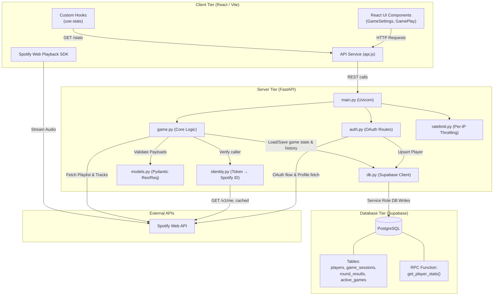
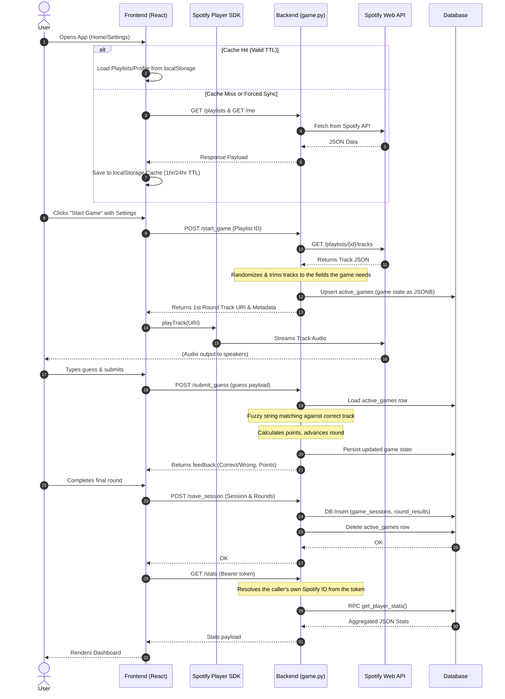
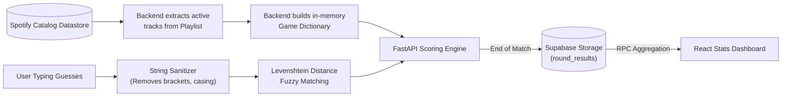
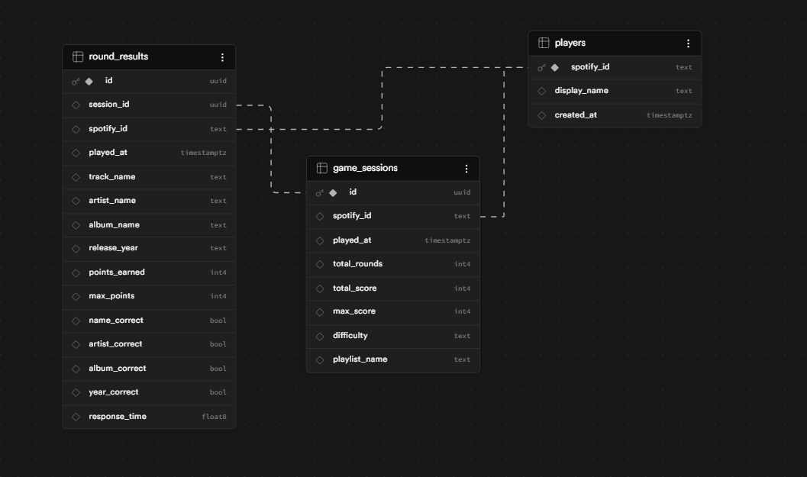
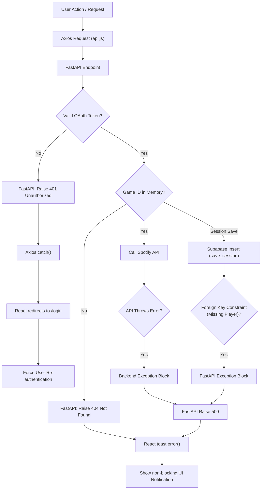

<div align="center">


# Beatify

**Guess the song from your own Spotify playlists.**

</div>

---

## 📸 Screenshots

<table>
  <tr>
    <td align="center"><br/><sub>Login · Dark</sub></td>
    <td align="center"><br/><sub>Login · Light</sub></td>
  </tr>
  <tr>
    <td align="center"><br/><sub>Home Screen · Dark</sub></td>
    <td align="center"><br/><sub>Home Screen · Light</sub></td>
  </tr>
  <tr>
    <td align="center"><br/><sub>Playlist Selection · Dark</sub></td>
    <td align="center"><br/><sub>Playlist Selection · Light</sub></td>
  </tr>
  <tr>
    <td align="center"><br/><sub>Gameplay · Dark</sub></td>
    <td align="center"><br/><sub>Gameplay · Light</sub></td>
  </tr>
  <tr>
    <td align="center"><br/><sub>Round Result · Dark</sub></td>
    <td align="center"><br/><sub>Round Result · Light</sub></td>
  </tr>
  <tr>
    <td align="center"><br/><sub>End Screen · Dark</sub></td>
    <td align="center"><br/><sub>End Screen · Light</sub></td>
  </tr>
</table>

---

## 🚀 Overview

Beatify is a music trivia game that turns any of your Spotify playlists into a live guessing challenge. Each round streams a short clip of a real song directly through the Spotify Web Playback SDK — no uploads, no pre-seeded data. You type what you hear: song name, artist, album, and release year.

The backend fetches tracks on demand from Spotify's API, scores your answers server-side using fuzzy string matching, and returns per-field breakdowns per round. A post-game analytics screen shows your accuracy rates, reflex times, and best streak across the session, all durably logged to a Supabase PostgreSQL database to construct an ongoing personal leaderboard.

---

## 💡 Why Beatify?

Most music guessing games use static, curated datasets — the same songs recycled across every session. Beatify is different: it plugs directly into your Spotify library, so every game reflects your actual taste.

If you've built a gym playlist, a road trip mix, or a decade-specific deep-cut collection, Beatify can immediately turn it into a trivia challenge. The difficulty is inherently personal — you're being tested on music *you* chose, which makes near-misses more frustrating and perfect rounds genuinely impressive.

---

## 🎮 Features

### Core Gameplay

- **Live Spotify Playback** — streams actual songs via the Spotify Web Playback SDK; no pre-recorded clips
- **Configurable Snippet Duration** — four difficulty tiers control how long the clip plays before you must guess
- **Multi-field Guessing** — independently toggle Song Name (always on), Artist, Album, and Release Year per session
- **Fuzzy Answer Matching** — server-side scoring via `rapidfuzz`; minor typos and small variations are forgiven
- **Replay Snippet** — a minimal, inline repeat button available during gameplay to re-listen to the snippet for tough rounds (deducts no points!)
- **Lifetime Aggregation** — all historical match data is preserved securely in Supabase and retrieved via an ultra-fast Remote Procedure Call to populate your career stat leaderboard.
- **Featured Artist Bonus** — each correctly guessed featured artist beyond the primary earns +1 extra point
- **Singles Rule** — when a track's album name equals its title (i.e. it's a single), typing `"single"`, `"none"`, `"no album"`, or the song name itself in the album field is accepted for full points

### Game Mechanics

- **Difficulty Levels**

  | Label | Snippet Duration |
  |-------|-----------------|
  | Listener | 10 seconds |
  | Performer | 5 seconds |
  | Producer | 3 seconds |
  | Virtuoso | 1 second |

- **Scoring**

  | Category | Points |
  |----------|--------|
  | Song Name | 5 |
  | Primary Artist | 2 |
  | Album | 3 |
  | Release Year | 2 |
  | Each Featured Artist | +1 |

- **Answer Timer** — optional countdown (10–60 s); auto-submits whatever is typed when it expires
- **Visual Hints** — three modes: Disabled (equalizer animation only), Progressive (album art reveals over 10 s), Manual Reveal (tap to unblur)
- **Streak Tracking** — live 🔥 counter increments on every perfect-score round; resets on any miss
- **Sanitization** — parenthesised text (e.g. `(Remix)`, `[Deluxe]`) stripped before comparison so partial matches don't penalise
- **Random Track Sampling** — backend samples random offsets across the full playlist without downloading all tracks; works on playlists of any size

### System Features

- **Dark / Light Mode** — Spotify-inspired colour palette; preference persisted in `localStorage` and applied before React hydrates (no flash)
- **Persistent Auth** — access and refresh tokens stored in `localStorage`; a global Axios interceptor silently refreshes the access token on 401s
- **Database Persistence** — game history securely logged to a Supabase PostgreSQL database via a backend `service_role` client, binding unique Spotify IDs to session histories flawlessly.
- **Server-Side Analytics Aggregation** — a native Postgres RPC function aggregates thousands of rows instantly within the database engine, returning a finalized, mathematically exact stats payload locally to eliminate O(N) client-side calculation loads.
- **High-Performance Caching** — frontend `localStorage` caching wrapper strictly handles API TTLs (Time-To-Live). User profiles and playlists load instantly without redundant API calls, while volatile dashboard statistics completely bypass the cache for absolute accuracy.
- **Session Logout & Sync** — deep cache-clearing mechanisms tied to a slick logout functionality and manual playlist sync buttons.
- **Post-game Analytics** — average and fastest reflex time, per-category hit accuracy percentages, max streak, scrollable match history with album art and per-field result indicators
- **Tiered Audio Feedback** — six distinct sound effects mapped to score percentage tiers on each round result screen
- **Tiered Text Feedback** — randomised sarcastic / congratulatory message per score tier shown on the round result screen
- **Inline Rulebook** — floating help widget available on every screen with full rules, scoring table, and typo-tolerance explanation

---

## 🧠 Architecture & Data Flow

### System Overview


```mermaid
graph TD
    %% Client Tier
    subgraph Client ["Client Tier (React / Vite)"]
        UI["React UI Components<br/>(GameSettings, GamePlay)"]
        API_JS["API Service (api.js)"]
        HOOKS["Custom Hooks<br/>(use-stats)"]
        PLAYER["Spotify Web Playback SDK"]
    end

    %% Server Tier
    subgraph Server ["Server Tier (FastAPI)"]
        MAIN["main.py (Uvicorn)"]
        AUTH_ROUTER["auth.py (OAuth Routes)"]
        GAME_ROUTER["game.py (Core Logic)"]
        DB_SERVICE["db.py (Supabase Client)"]
        MODELS["models.py (Pydantic Res/Req)"]
        IDENTITY["identity.py (Token → Spotify ID)"]
        LIMITER["ratelimit.py (Per-IP Throttling)"]
    end

    %% Database Tier
    subgraph DB ["Database Tier (Supabase)"]
        POSTGRES[("PostgreSQL")]
        TABLES["Tables:<br/>players, game_sessions,<br/>round_results, active_games"]
        RPC["RPC Function:<br/>get_player_stats()"]
    end

    %% Third-Party
    subgraph External ["External APIs"]
        SPOTIFY_API["Spotify Web API"]
    end

    %% Interactions
    UI -->|HTTP Requests| API_JS
    API_JS -->|REST calls| MAIN
    HOOKS -->|GET /stats| API_JS
    
    MAIN --> LIMITER
    MAIN --> AUTH_ROUTER
    MAIN --> GAME_ROUTER
    
    AUTH_ROUTER -->|OAuth flow & Profile fetch| SPOTIFY_API
    AUTH_ROUTER -->|Upsert Player| DB_SERVICE
    
    GAME_ROUTER -->|Verify caller| IDENTITY
    IDENTITY -->|GET /v1/me, cached| SPOTIFY_API
    GAME_ROUTER -->|Fetch Playlist & Tracks| SPOTIFY_API
    GAME_ROUTER -->|Validate Payloads| MODELS
    GAME_ROUTER -->|Load/Save game state & history| DB_SERVICE
    
    DB_SERVICE -->|Service Role DB Writes| POSTGRES
    POSTGRES --- TABLES
    POSTGRES --- RPC
    
    PLAYER -->|Stream Audio| SPOTIFY_API
```

### Component Interaction (User Request Sequence)


```mermaid
sequenceDiagram
    autonumber
    actor User
    participant React as Frontend (React)
    participant SDK as Spotify Player SDK
    participant FastAPI as Backend (game.py)
    participant Spotify as Spotify Web API
    participant Supabase as Database

    %% App Initialization & Caching
    User->>React: Opens App (Home/Settings)
    alt Cache Hit (Valid TTL)
        React->>React: Load Playlists/Profile from localStorage
    else Cache Miss or Forced Sync
        React->>FastAPI: GET /playlists & GET /me
        FastAPI->>Spotify: Fetch from Spotify API
        Spotify-->>FastAPI: JSON Data
        FastAPI-->>React: Response Payload
        React->>React: Save to localStorage Cache (1hr/24hr TTL)
    end

    %% Start Game
    User->>React: Clicks "Start Game" with Settings
    React->>FastAPI: POST /start_game (Playlist ID)
    FastAPI->>Spotify: GET /playlists/{id}/tracks
    Spotify-->>FastAPI: Returns Track JSON
    Note over FastAPI: Randomizes & trims tracks to the fields the game needs
    FastAPI->>Supabase: Upsert active_games (game state as JSONB)
    FastAPI-->>React: Returns 1st Round Track URI & Metadata

    %% Play Audio
    React->>SDK: playTrack(URI)
    SDK->>Spotify: Streams Track Audio
    Spotify-->>User: (Audio output to speakers)

    %% Submit Guess
    User->>React: Types guess & submits
    React->>FastAPI: POST /submit_guess (guess payload)
    FastAPI->>Supabase: Load active_games row
    Note over FastAPI: Fuzzy string matching against correct track
    Note over FastAPI: Calculates points, advances round
    FastAPI->>Supabase: Persist updated game state
    FastAPI-->>React: Returns feedback (Correct/Wrong, Points)

    %% End Game
    User->>React: Completes final round
    React->>FastAPI: POST /save_session (Session & Rounds)
    FastAPI->>Supabase: DB Insert (game_sessions, round_results)
    FastAPI->>Supabase: Delete active_games row
    Supabase-->>FastAPI: OK
    FastAPI-->>React: OK

    %% Fetch Stats
    React->>FastAPI: GET /stats (Bearer token)
    Note over FastAPI: Resolves the caller's own Spotify ID from the token
    FastAPI->>Supabase: RPC get_player_stats()
    Supabase-->>FastAPI: Aggregated JSON Stats
    FastAPI-->>React: Stats payload
    React-->>User: Renders Dashboard
```

### Data Processing Flow


```mermaid
flowchart LR
    %% Inputs
    InputA[("Spotify Catalog Datastore")]
    InputB["User Typing Guesses"]

    %% Processing
    ExtractTracks["Backend extracts active<br/>tracks from Playlist"]
    StateBuilder["Backend builds in-memory<br/>Game Dictionary"]
    Sanitize["String Sanitizer<br/>(Removes brackets, casing)"]
    FuzzyMatch["Levenshtein Distance<br/>Fuzzy Matching"]
    ComputeStats["FastAPI Scoring Engine"]

    %% Outputs
    OutputDashboard["React Stats Dashboard"]
    OutputDB[("Supabase Storage<br/>(round_results)")]

    %% Flow
    InputA --> ExtractTracks
    ExtractTracks --> StateBuilder
    StateBuilder --> ComputeStats

    InputB --> Sanitize
    Sanitize --> FuzzyMatch
    FuzzyMatch --> ComputeStats

    ComputeStats -->|End of Match| OutputDB
    OutputDB -->|RPC Aggregation| OutputDashboard
```

Active game state is persisted to Postgres as a JSONB blob keyed by the player's verified Spotify ID, so a server restart or a second backend instance never orphans a game in progress. Long-term gameplay history is delegated to the PostgreSQL analytics engine via Remote Procedure Calls.

### Database Schema



### Error Handling & Exception Flow


```mermaid
flowchart TD
    Start["User Action / Request"] --> API["Axios Request (api.js)"]
    
    API --> Backend["FastAPI Endpoint"]
    
    %% API Edge Errors
    Backend --> ValidToken{"Valid OAuth Token?"}
    ValidToken -- No --> TokenError["FastAPI: Raise 401 Unauthorized"]
    TokenError --> ClientCatch["Axios catch()"]
    ClientCatch --> RedirectLogin["React redirects to /login"]
    
    %% Business Logic Errors
    ValidToken -- Yes --> ValidGame{"Game ID in Memory?"}
    ValidGame -- No --> GameError["FastAPI: Raise 404 Not Found"]
    GameError --> ClientCatchToast["React toast.error()"]
    
    %% Third-party Exceptions
    ValidGame -- Yes --> SpotifyCall["Call Spotify API"]
    SpotifyCall --> SpotifyFail{"API Throws Error?"}
    SpotifyFail -- Yes --> TryCatchPlay["Backend Exception Block"]
    TryCatchPlay --> HTTP500["FastAPI Raise 500"]
    HTTP500 --> ClientCatchToast
    
    %% Database Constraints Errors
    ValidGame -- Session Save --> DBSave["Supabase Insert (save_session)"]
    DBSave --> DBFail{"Foreign Key Constraint<br/>(Missing Player)?"}
    DBFail -- Yes --> TryCatchDB["FastAPI Exception Block"]
    TryCatchDB --> HTTP500
    
    %% User Facing Results
    ClientCatchToast --> DisplayToUser["Show non-blocking UI Notification"]
    RedirectLogin --> RefreshState["Force User Re-authentication"]
```

---

## 🔧 Engineering Challenges

**Timer synchronisation with SDK latency**
The Spotify Web Playback SDK has a variable delay between the `playTrack` API call and the moment audio actually reaches the speaker. Starting the guess timer on the API call would consistently cheat players out of time. The fix: defer the timer start until `player_state_changed` fires with `!state.paused && state.position > 0`, guaranteeing the countdown only begins when sound is audible.

**Fuzzy matching across noisy real-world input**
Freeform text fields produce inconsistent guesses — extra words, punctuation, alternate spellings, parenthetical tags (`(Remix)`, `[Deluxe Edition]`). A two-pass strategy handles this: first strip brackets and collapse whitespace, then apply `token_set_ratio` for song/album fields and a combined global + per-chunk `ratio` check for multi-artist comma-separated input.

**Scalable random sampling on large playlists**
Fetching all tracks from a 600-track playlist to sample 10 is wasteful. Instead, the backend computes random absolute indices upfront, groups them by 50-track page offset, and issues only the minimal number of Spotify API calls needed — typically 1–3 requests regardless of playlist size.

**Transparent token refresh without user disruption**
SPAs lose state on refresh, and Spotify access tokens expire after an hour. A global Axios response interceptor catches 401s, silently exchanges the stored refresh token for a new access token, patches the original failed request, and retries — without the user seeing an error or being logged out.

**Flash of wrong theme on load**
Applying a CSS class via React state causes a brief flash of the default theme before hydration completes. The fix: an inline `<script>` in `index.html` reads `localStorage` and sets the correct class on `<html>` synchronously before any React code runs.

---

## ⚙️ Tech Stack

### Frontend
| Library | Purpose |
|---------|---------|
| React 18 + TypeScript | UI framework |
| Vite | Build tool and dev server |
| Tailwind CSS | Utility-first styling |
| shadcn/ui + Radix UI | Accessible component primitives |
| Axios | HTTP client with interceptor-based token refresh |
| Sonner | Toast notifications |
| lucide-react | Icon set |
| Spotify Web Playback SDK | In-browser audio streaming |

### Backend
| Library | Purpose |
|---------|---------|
| FastAPI | API framework |
| Uvicorn | ASGI server |
| Requests | Spotify Web API calls |
| rapidfuzz | Fuzzy string matching for answer scoring |
| python-dotenv | Environment variable loading |

### Database
| Technology | Purpose |
|---------|---------|
| Supabase | Cloud persistent data storage |
| PostgreSQL | Embedded relational DB backend |
| Row Level Security (RLS) | Secures individual dashboard `SELECT` queries seamlessly out-of-the-box |
| PL/pgSQL | Language orchestrating backend RPC statistical aggregation formulas |

### Integrations
- **Spotify Web API** — playlists, track metadata, OAuth 2.0 Authorization Code flow
- **Spotify Web Playback SDK** — in-browser Premium audio playback

---

## 📦 Installation

### Prerequisites
- Python 3.10+ (the codebase uses `X | None` type syntax)
- Node.js 18+
- A Spotify Developer app with a registered redirect URI
- A Supabase project (free tier is sufficient)

### 1. Spotify App Setup

1. Go to [Spotify Developer Dashboard](https://developer.spotify.com/dashboard)
2. Create an app and add `http://127.0.0.1:8000/callback` as a Redirect URI

   > Spotify now requires redirect URIs to use HTTPS, with an exception for
   > explicit loopback literals. `http://localhost:...` may be rejected on a
   > newly created app — use `127.0.0.1` locally.
3. Copy your **Client ID** and **Client Secret**

### 2. Database Setup

Run the SQL files in `backend/sql/` against your Supabase project (SQL Editor →
New query) in numerical order. `002_active_games.sql` creates the table that
holds in-flight game state and revokes browser-level access to the game tables.

### 3. Backend

```bash
cd backend

# Create and activate virtual environment
python -m venv venv
venv\Scripts\activate        # Windows
# source venv/bin/activate   # macOS / Linux

# Install dependencies
pip install -r requirements.txt

# Create environment file
cp .env.example .env
# Fill in every variable — see the table in the Deployment section below

# Start the server
uvicorn main:app --reload
# Runs at http://localhost:8000
```

### 4. Frontend

```bash
cd frontend

npm install
npm run dev
# Runs at http://localhost:5173
```

---

## 🌍 Deployment

Beatify is a decoupled monorepo: a static frontend, a stateless FastAPI
backend, and Supabase for all persistence. The whole thing runs on free tiers.

### Step 1 — Database

In the Supabase SQL Editor, run every file in `backend/sql/` in order. Confirm
`active_games` exists before deploying the backend; `/start_game` fails without
it.

### Step 2 — Backend (Render, free tier)

New → Web Service → connect the repo, then:

| Setting | Value |
|---|---|
| Root Directory | `backend` |
| Runtime | Python 3 |
| Build Command | `pip install -r requirements.txt` |
| Start Command | `uvicorn main:app --host 0.0.0.0 --port $PORT` |

Deploy once to get your service URL (e.g. `https://beatify-api.onrender.com`),
then set the environment variables in Step 4.

### Step 3 — Frontend (Vercel, free tier)

| Setting | Value |
|---|---|
| Root Directory | `frontend` |
| Framework Preset | Vite |
| Build Command | `npm run build` |
| Output Directory | `dist` |

`vercel.json` already rewrites all paths to `index.html`, which the OAuth
callback needs in order to land on `/login`.

### Step 4 — Wire the environment

These five values reference each other. A mismatch in any one of them produces
a failure that looks like a bug somewhere else, so set them together.

| Where | Variable | Value |
|---|---|---|
| Spotify Dashboard | Redirect URI | `https://<backend-url>/callback` |
| Render | `REDIRECT_URI` | identical to the above, character for character |
| Render | `FRONTEND_URL` | `https://<frontend-url>` (no trailing slash) |
| Render | `ALLOWED_ORIGINS` | `https://<frontend-url>` |
| Render | `SPOTIFY_CLIENT_ID` / `SPOTIFY_CLIENT_SECRET` | from the Spotify dashboard |
| Render | `SESSION_SECRET` | `python -c "import secrets; print(secrets.token_urlsafe(32))"` |
| Render | `SUPABASE_URL` / `SUPABASE_SERVICE_KEY` | Supabase → Project Settings → API |
| Vercel | `VITE_API_BASE_URL` | `https://<backend-url>` |

### Step 5 — Grant users access

A Spotify app starts in **Development Mode**: 25 users maximum, each added by
hand. Dashboard → your app → **User Management** → add each player's name and
the email on their Spotify account. Anyone not on that list gets a 403 on every
request. Everyone also needs **Spotify Premium** — the Web Playback SDK will
not stream audio for free accounts.

### Free-tier caveats

- **Render spins the service down after ~15 minutes idle.** The next request
  takes ~50 seconds while it boots. Game state now lives in Postgres, so
  nothing is lost — it is a latency problem, not a correctness one. To avoid
  it, point [UptimeRobot](https://uptimerobot.com) (free) at
  `https://<backend-url>/health` on a 5-minute interval, or enable the
  `.github/workflows/keepalive.yml` workflow in this repo. Note that a
  permanently warm service consumes roughly all 750 free instance-hours per
  month, so keep it to one service.
- **`VITE_*` variables are baked in at build time.** Changing
  `VITE_API_BASE_URL` requires a redeploy, not just an env var edit.
- **Vercel preview deployments get unique URLs** that will not match
  `ALLOWED_ORIGINS`, so previews fail CORS. Test against production, or add the
  preview domain to the list.

---

## ▶️ Usage

1. **Login** — open `http://localhost:5173`, click **Connect with Spotify**, and authorise via the Spotify OAuth flow
2. **Configure** — choose difficulty, toggle timer and answer categories, set round count, and pick a playlist from your library
3. **Play** — a short snippet streams automatically; type song name, artist, album, and/or year before the timer expires, then press **Submit Guess**
4. **Review** — the round result screen reveals the correct answer, your points, and plays a sound effect scaled to your score
5. **End screen** — after the final round, view your total score, accuracy per category, reflex times, and scrollable match history; replay with the same settings or return to configure

---

## 🔐 Important Notes

- **Spotify Premium is required** for audio playback via the Web Playback SDK. Free accounts cannot stream tracks in-browser.
- **Development Mode caps the app at 25 users**, each added manually in the Spotify dashboard. Lifting that cap requires an Extended Quota Mode application, which Spotify grants to registered organizations rather than individuals.
- **Spotify-owned editorial playlists** (Discover Weekly, Today's Top Hits, etc.) are not accessible to apps in Development Mode. Only the user's own and other user-created playlists will work.
- **OAuth scopes requested**: `user-read-private`, `user-read-email`, `playlist-read-private`, `playlist-read-collaborative`, `streaming`, `user-read-playback-state`, `user-modify-playback-state`
- **Game state is persisted**, keyed by the Spotify user ID resolved from the caller's access token. Restarting the backend does not end an in-flight game, and no endpoint accepts a caller-supplied user ID.
- **Access tokens are stored in `localStorage`**, which is readable by any script running on the page. This is the standard trade-off for a backend-less SPA session and is acceptable here; it would not be for an app handling sensitive data.
- **Rate limits are per-instance and in-memory** (120 req/min global, tighter on expensive routes). Adequate for a single backend; point `slowapi` at Redis if you ever run more than one.
- The frontend dev server and backend must both be running simultaneously; the Spotify redirect URI must match exactly what is registered in your Developer Dashboard

---

## 📁 Project Structure

```
Beatify/
├── backend/
│   ├── main.py          # FastAPI app, CORS, rate-limit middleware, /health
│   ├── auth.py          # /login, /callback, /refresh + signed OAuth state
│   ├── game.py          # /playlists, /start_game, /submit_guess, /next_round, /stats
│   ├── identity.py      # Verifies an access token → Spotify ID (TTL cached)
│   ├── ratelimit.py     # Shared slowapi limiter, proxy-aware client key
│   ├── db.py            # Supabase SDK: game state, history, stats RPC
│   ├── models.py        # Pydantic models (GuessSubmission, SaveSessionRequest)
│   ├── sql/             # Migrations to run in the Supabase SQL editor
│   ├── requirements.txt # Pinned
│   └── .env.example
│
├── frontend/
│   ├── public/
│   │   ├── favicon.svg       # Custom waveform logo
│   │   └── audio/            # SFX files (bell chime, violin win, game fail, …)
│   └── src/
│       ├── pages/
│       │   └── Index.tsx     # Root orchestrator — phase state machine, SDK init, playback
│       ├── components/game/
│       │   ├── LoginScreen.tsx
│       │   ├── GameSettings.tsx
│       │   ├── GamePlay.tsx
│       │   ├── RoundResult.tsx
│       │   ├── GameOver.tsx
│       │   ├── Rulebook.tsx
│       │   └── ThemeToggle.tsx
│       ├── hooks/
│       │   ├── use-theme.ts  # Dark/light mode with localStorage persistence
│       │   └── use-stats.ts  # Executes Postgres RPC calls for user analytics
│       └── api.js            # Axios instance, interceptor, all API calls
│
└── pics/                     # UI screenshots (dark + light variants)
```

---

## 📈 Future Improvements

- **Global Leaderboards** — aggregate all player rows via SQL to implement a global Top 10 High-score ranking
- **Multiplayer** — shared game sessions with WebSocket synchronisation
- **More hint types** — lyrics snippet, genre tag, decade hint

---

## 📄 License

MIT License. See [LICENSE](LICENSE) for details.

---

## 🙌 Credits

- [Spotify Web API](https://developer.spotify.com/documentation/web-api) — track data and OAuth
- [Spotify Web Playback SDK](https://developer.spotify.com/documentation/web-playback-sdk) — in-browser audio
- [rapidfuzz](https://github.com/maxbachmann/RapidFuzz) — fuzzy string matching
- [shadcn/ui](https://ui.shadcn.com) — component library
- [Lucide](https://lucide.dev) — icon set
